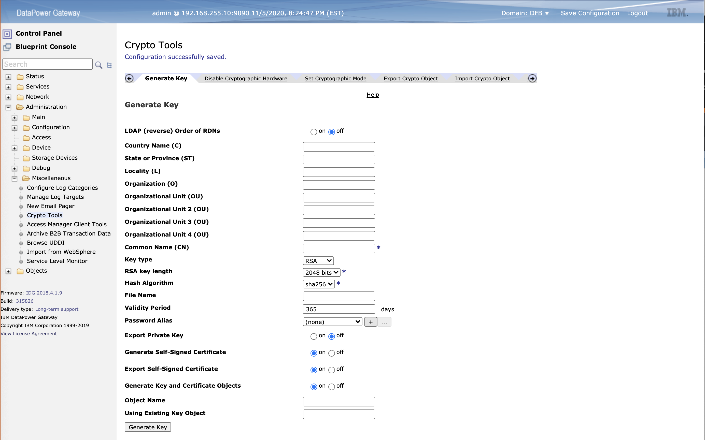

# Criando certificados no Datapower

## Esse guia tem como objetivo gerar um certificado fora do Datapower e importá-lo gerando os objetos de referência.

---

### Etapas:
- Gerar um certificado via OpenSSL
- Validar o certificado
- Criação de Password Map Alias
- Criação do objeto Crypto Key
- Criação do objeto Crypto Certificate
- Criação do objeto Crypto Identification Credentials
- Criação de chave pública/chave privada utilizando o Datapower

---

## Gerar um certificado via OpenSSL

Para gerar um certificado fora do Datapower pode-se utilizar vários recursos, para esse caso iremos utilizar o OpenSSL.

---
**NOTE**

O certificado pode ser gerado para ser utilizado especificamente apenas em um único host, para isso o campo **Common Name** precisa ser definido com o _fully qualified host name_

---

Para gerar um certificado e definir os atributos dele, utilize o comando abaixo, com isso será gerado uma chave privada/pública do tipo RSA com 2048 bits e com validade de 365 dias.

```
openssl req -x509 -newkey rsa:2048 -keyout key.pem -out cert.pem -days 365
```

Exemplo de utilização:

 

## Validar um certificado via OpenSSL

Para validar uma chave privada:
 
```
openssl rsa -in key.pem -check
```
--- 

## Criação de Password Map Alias

O Password Map Alias é utilizado para salvar a senha de certificados.

 

---
## Criação do objeto Crypto Key

O objeto **Crypto Key** é utilizado para armazenar uma chave privada

1 - Ao acessar o WebGUI do console do IDG, no campo busca pesquise por Crypto Key e clique nele, clique no botão **Add**

2 - Preencha o formulário com o nome do objeto, aponte para o diretório **cert**, e clique em upload para abrir uma nova tela e selecione o arquivo para envio.

3 - No campo **password alias** clique no ícone de adicionar (+) e atribua a senha que foi utilizada durante a criação do certificado e clique em **Apply**

4 - Com isso a chave privada foi incluída, para validar se ela foi incluída com sucesso, verifique o status, deve está **Up**

5 - Caso o certificado tenha algum problema como falta do password alias, o status deve ser down

 

Com isso a chave privada foi incluída.

---

##  Criação do objeto Crypto Certificate

O objeto **Crypto Certificate** é utilizado para armazenar uma chave pública.

As etapas de criação de um objeto Crypto Certificate são bem semelhantes a um Crypto Key, digite no Search **Crypto Certificate** e clique em Add.

Selecione o diretório **cert** faça o upload do certificado clicando em **Upload**, depois atribua o **password alias**, no campo **Ignore expiration dates** marque **on** e por fim clique no botão **apply** 

 

---

## Criação do objeto Crypto Identification Credentials

O Objeto Crypto Identification Credentials é utilizado para expor algum serviço para SSL/TLS, logo, caso você precise expor um HTTPS, você irá precisar ter um CIC criado, para criar um CIC é necessário já ter um Crypto Certificate e Crypto Key.

Para criar um CIC digite **Crypto Identification Credentials** no campo search e acesse esta opção e clique no botão **add**.

Dê um nome para o CIC, localize o Crypto Key e o Crypto Certificate e selecione um **Intermediate CA Certificate** caso possua e clique no botão **Apply** e verifique se o status mudou para **up**

 

## Criação de chave pública/chave privada utilizando o Datapower

O Datapower fornece um recurso para criação de chaves públicas/privadas, para isso acesse o **Crypto Tools**

 