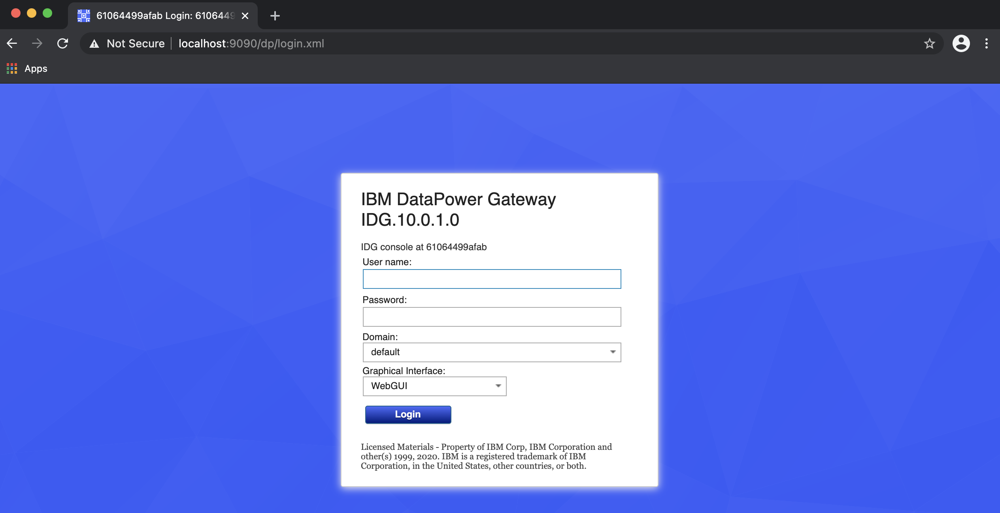

# Como executar Datapower no Unix

### Datapower pode ser entregue em diferentes formatos: Física, VMware, Linux, Cloud(pública ou privada) e Docker, este artigo irá tratar como como utilizar o Datapower deste último formato, iremos utilizar a imagem do datapower disponível em: https://hub.docker.com/r/ibmcom/datapower/.

### Esta imagem possui licenciamento apenas para desenvolvimento portanto, não pode ser levada para produção.

### Para executar o Datapower on Docker é necessário ter:

- Docker instalado e configurado
- Ter 4gb de memória RAM
- 2 CPUs

#### Como iniciar o Datapower, caso não tenha uma imagem do Datapower localmente, ele irá baixar.
```
docker run -it \
   -v $PWD/config:/drouter/config \
   -v $PWD/local:/drouter/local \
   -e DATAPOWER_ACCEPT_LICENSE=true \
   -e DATAPOWER_INTERACTIVE=true \
   -p 9090:9090 \
   -p 9022:22 \
   -p 5554:5554 \
   -p 7000-7030:7000-7030 \
   --name idg \
   ibmcom/datapower
```


#### Com isso, ele irá subir uma imagem nova, liberando 30 portas para uso, da 7000 até a 7030, que pode ser utilizadas para o HTTP Handlers por exemplo, porém o console web ainda não estará disponível, para inicia-lo, após iniciar o datapower via linha de comando você irá colocar com o usuário/senha admin/admin.

#### Para ativar o console web será necessário configurá-lo da seguinte forma:
```
configure terminal
web-mgmt
admin-state enabled
local-address eth0_ipv4_1 "9090"
exit
```

 


#### Acesse a url: https://localhost:9090
 

